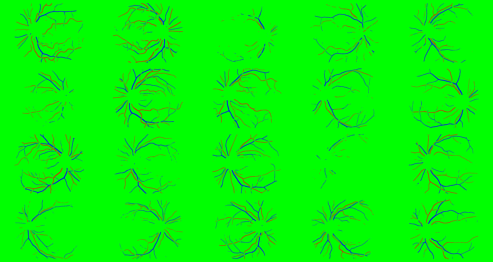
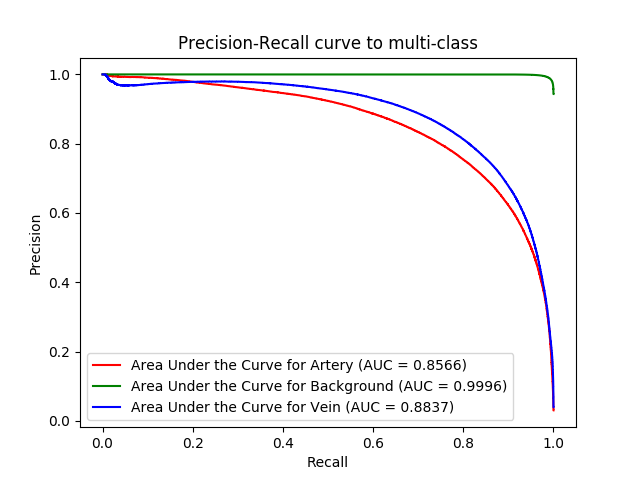

# U-Net Retinal Vessel Segmentation

In a nutshell, the purpose of our project is to train a classifier that can classify pixels from retinal fundus images into one of the three categories including artery, vein or background with high accuracy. In this way, the automation of retinal vessel segmentation process can be achieved and oculists may hopefully be relieved from the labor-intensive task of drawing out the vessels by hand. Thanks for Orobix's [source code](https://github.com/orobix/retina-unet).

## Raw Test Images:

## Ground Truth Test Images:

## Predictions for Test Images:

## Precision-Recall Curves for Individual Classes:
